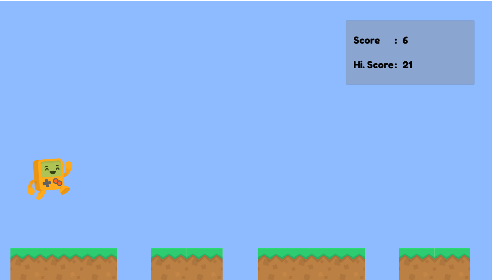

# Endless Runner

A game where player have to upgrade every resource to become rich in game. 

Project features:
1. Object Pooling
1. Character movement
1. Singleton
1. Audio
1. Animation

## Getting Started
1. Clone this repository to your computer/laptop
1. Open it with Unity (Recommended Unity 2018.3.3f1)
1. Play with it (Click your mouse to jump)

## How to Install
1. Go to [Release tab](https://github.com/alfianAH/endless-runner/releases)
1. Choose between EndlessRunner_x86.exe or EndlessRunner_x64.exe. Choose the one that suits your computer/laptop. **Make sure it is the latest version.**
1. It will automatically download the file to your computer.
1. After downloading, play it by clicking on file (It's portable executable for v1.1 or higher)
1. Done.

## Example Scene

